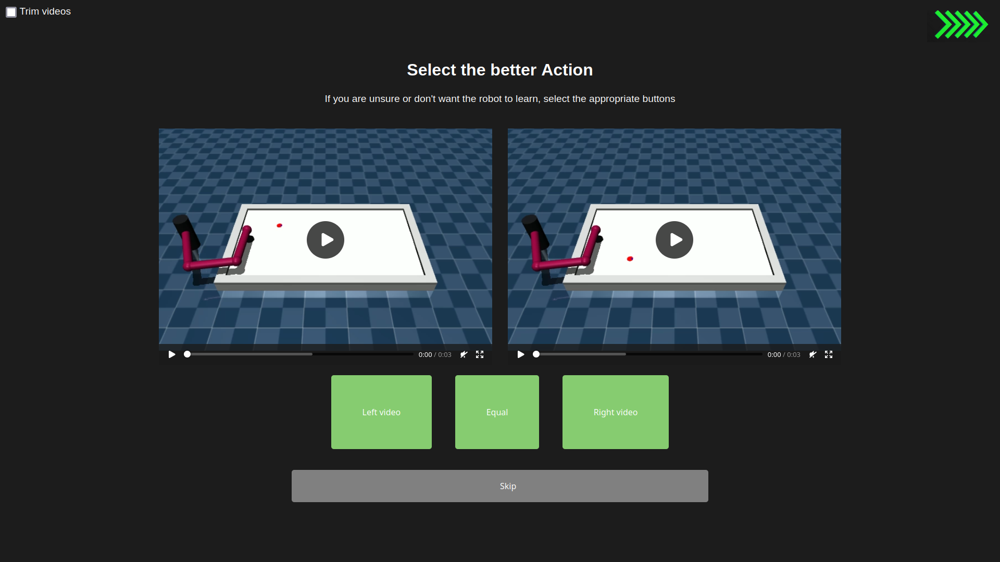

# RLArena

This projects builds upon the [fancy_gym](https://github.com/ALRhub/fancy_gym) library and aims to provide a framework for researchers to collect human feed back for preference-based RL efficiently.



## Installation

### \[Optional\] Install conda and create a new conda env:
```bash
conda -n RLHF python=3.8.18
conda activate RLHF
```
Note: Any Python version $\geq 3.8$ should work, but it has been successfully tested on $3.8.18$, so use that unless you have a reason to use a newer or older one.

### Installation with pip
```bash
pip install RLDuels
```

> **Note:**
> some of the required packages might cause trouble in the installation process. Frequent issues persist with: [Fancy_Gym](https://github.com/ALRhub/fancy_gym/), specifically the [mujoco](https://github.com/openai/mujoco-py) dependency.
### Installation from master
```bash
git clone git@github.com:theonetruekn/RLDuels.git
```
```bash
cd RLDuels
pip install -e .
```

## Roadmap
- Store identifiable attributes of each TrajectoryPair separately in a structured way within the database, and using these attributes for querying rather than the entire object.
- Migrate from Flask to FastAPI or Django
- use pickle for serialization
- validated parallelizability
- write demo for easier onboarding
